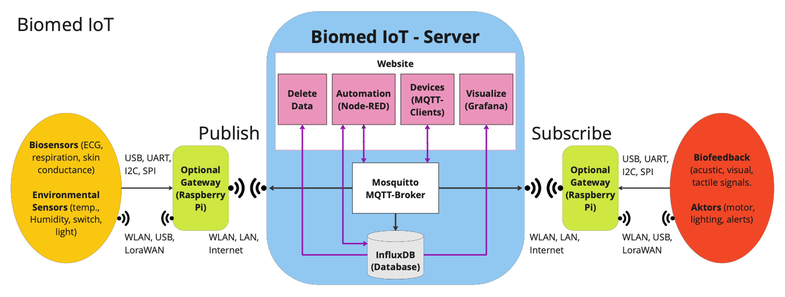

# Biomed IoT

Biomed IoT is an open source IoT platform for data acquisition, visualization and automation. It enables the integration and real-time analysis of sensors and effector devices. It is optimized for data security and privacy, making it suitable for medical data, such as in clinical trials. It is built on the Django framework and provides its core functionality by integrating the Eclipse Mosquitto™ MQTT broker, Node-RED, InfluxDB&reg; 2.0 and Grafana&reg;.

## Content
- [Installation](#installation)
- [Performance Testing](#performance-testing)
    - [Requirements](#requirements)
    - [Setup](#setup)
    - [Troubleshooting](#troubleshooting)
- [How it works](#how-it-works)
- [How to use](#how-to-use)

## Installation:

### Requirements
The setup and platform have been tested on a cleanly installed Debian 12 server (x86 and ARM) and under Raspberry Pi OS (64-Bit) on a Raspberry Pi 4, both running Python 3.11.2. It is recommended that you create a new Linux user (included in the sudo group) under which the platform will run.

### Setup
If you are setting up Biomed IoT on a Raspberry Pi, you can use [Debian for Pi](https://raspi.debian.net) or, the easier way, [Raspberry Pi OS light (64 Bit)](https://www.raspberrypi.com/software/operating-systems/), flashed to an SD-card using the [Raspberry Pi Imager](https://www.raspberrypi.com/software/).

First prepare your system for the Biomed IoT setup. Read the instructions carefully before executing the following commands:

Switch to user 'root' and enter the password when prompted
```
su -
```
Create a new user if you have not already done so with the command below (choose your own name for <your-username>) and follow the instructions (entries for "Full name", "Room number" etc. are not necessary):
```
adduser <your-username>
```
Install the 'sudo' command capability. This will later allow your user to temporarily perform a command with root privileges
```
apt install sudo
```
Add your newly created user to the sudo group
```
usermod -G sudo <your-username>
```
To use 'sudo' without being prompted for the password, execute
```
sudo visudo
```
A file opens in the editor (e.g. nano). Append this line to the end of the file:
```
<your-username> ALL=(ALL) NOPASSWD: ALL
```
Make sure your system is up to date by executing
```
sudo apt update
sudo apt -y full-upgrade
```
Install the following packages:
```
sudo apt -y install net-tools
sudo apt -y install git
sudo apt -y install python3-pip
sudo apt -y install python3-venv
``` 
Then reboot
```
sudo reboot
```

The guided installation process will ensure that Biomed IoT is installed on your system.  
Clone the repository and start the Biomed IoT installation by executing the following commands
```
cd ~
git clone https://github.com/BioMedLab-HM/biomed-iot.git
cd biomed-iot
sudo python3 setup.py
```
Consider reading the information, given in the last lines at the end of the installation (e.g. for the URL to reach Biomed IoT in the web browser), then reboot:
``` 
sudo reboot
```
Biomed IoT should now be up and running. Type your server's IP address, host name or domain in a web browser.

To log in as admin, use the email address you provided during setup. The password was auto-generated. You can find it by running the following command in the terminal:
```
nano /etc/biomed-iot/config.toml
# If you need to edit this file use
sudo nano /etc/biomed-iot/config.toml
```
Look for the 'DJANGO_ADMIN_PASS' line at the bottom of the file to find your password.
Close the file by pressing Ctrl+x.

### Troubleshooting
- Do not abort the setup process prematurely. Depending on the speed of the download servers, the duration of the setup can vary, usually between five and 15 minutes.
- The setup script requires sudo privileges. Ensure that the user running the setup has sudo privileges.
- The safest way to repeat the installation of Biomed IoT is to first setup your operating system from scratch (e.g. flashing the SD card for your Pi).
- Execute the [*Tests After Installation*](tests/tests_after_setup.md) to check the integrity of your installation.

## Performance Testing
A test script to measure core website performance is coming soon...

## How it Works
Once the master's thesis about this project is published, you can read about technical details there.
Below figure explains the functionality of Biomed IoT on a high level.


## How to Use
The [*USER-MANUAL*](USER-MANUAL.md) (see also 'Manual' in the website menu) contains a guided tour through Biomed IoT and helps you to set up a working example.

Use the platform at your own risk. If you publish it on the internet, use a legitimate privacy policy and imprint. 

[(Go Back to top)](#biomed-iot)
#
Have fun using Biomed IoT!  

René Sesgör ([GitHub](https://github.com/AwakeAndReady))
